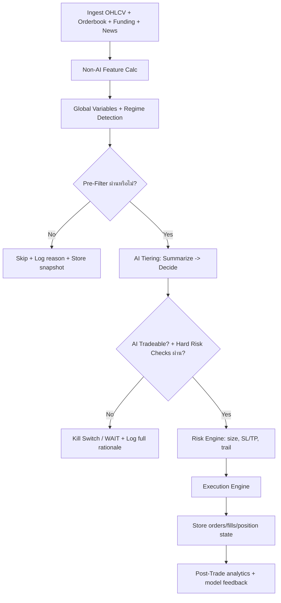

# Zenith Trading Bot Direction (Master Playbook)

เอกสารนี้คือคัมภีร์หลักสำหรับออกแบบ/พัฒนา Zenith ให้พร้อมใช้งานจริงแบบวัดผลได้, debug ได้, และขยายต่อได้

## Output Summary Index (ตามที่กำหนด)

1. DB Schema -> Section `8`
2. List Formulas -> Section `5.3` และ `6.3`
3. Functions หลัก -> Section `9`
4. Input/Output Data -> Section `10`
5. Flow การทำงาน -> Section `3` และ `11`
6. ข้อเสนอแนะเพิ่มเติม -> Section `16`
7. Detail Functional/Technical/Tech Stack -> Section `13`
8. Specs + Implementation Tracking -> Section `18-20`

## 0) เป้าหมายหลัก

- แยกสถาปัตยกรรมเป็น 2 แกนชัดเจน: `AI Core` และ `Deterministic Core (Non-AI)`
- ลดต้นทุน token และเพิ่มความเสถียรของการตัดสินใจ
- ใช้ global variables ที่สะท้อนตลาดจริง (regime/volatility/liquidity/correlation)
- ใช้ dynamic/adaptive formulas ตามสภาพตลาด ไม่ fix ค่าเดียวทั้งระบบ
- ทุก input/decision/output ต้อง track ลง DB เพื่อ replay และ post-mortem ได้
- มี kill switch ที่ไม่พึ่ง AI อย่างเดียว (AI + hard rules)

## 1) Core Design Principles

1. Precision over frequency: เทรดน้อยลงแต่คุณภาพสูงขึ้น
2. AI is advisor, deterministic is governor: AI ให้มุมมอง, กฎ deterministic เป็นคนอนุมัติสุดท้าย
3. Event-driven AI calls: เรียก AI เฉพาะเมื่อผ่าน pre-filter เพื่อลด token
4. Replayability first: ทุก decision ต้องย้อนรอยได้ด้วย run_id + decision graph
5. Safety-first execution: order idempotency, circuit breaker, fallback, audit log ครบ

## 2) Architecture (AI vs Non-AI)

### 2.1 Non-AI Core (Always-On)

- Market Data Ingestion
- Indicator Engine
- Regime Engine
- Rule Engine (hard guardrails)
- Risk Engine (position sizing, stop logic)
- Execution Engine (paper/live)
- Persistence + Audit + Metrics

### 2.2 AI Core (Selective/Adaptive)

- Tier A: `Market Collector AI` (optional) สกัดข้อมูล text/news เฉพาะที่จำเป็น
- Tier B: `Signal Summarizer AI` สรุป context ให้สั้นและ normalize feature
- Tier C: `Decision AI` ให้ recommendation + confidence + rationale
- Tier D: `Post-Trade Analyst AI` วิเคราะห์ผลหลังปิด position เพื่อปรับ parameter

### 2.3 TVScreener Integration Policy (Decision on 2026-02-18)

- ใช้ `tvscreener` เฉพาะ 2 งาน:
  - Dashboard market overview/heatmap
  - Candidate scan (farming universe pre-filter)
- ห้ามใช้ `tvscreener` เป็นแหล่งข้อมูลหลักสำหรับ:
  - final execution price
  - order placement logic
  - stop-loss/trailing-stop trigger
- Source priority:
  - `CCXT exchange data` = execution truth source
  - `tvscreener` = research/screening enrichment

## 3) Trading Loop ที่แนะนำ (ประสิทธิภาพสูง + วัดผลได้)



### 3.1 Loop sequencing (ต่อ 1 cycle)

1. Collect market snapshot (multi-timeframe) + screener snapshot for ranking
2. คำนวณ indicators + global variables
3. Pre-filter deterministic (volume/spread/slippage/risk budget)
4. เรียก AI เฉพาะคู่ที่ผ่าน pre-filter
5. รวมผล AI + hard rules -> final decision
6. สั่ง execution แบบ idempotent
7. บันทึกทุกอย่างลง DB (รวม prompt hash, feature hash, reasons)
8. อัปเดต session metrics, drawdown, win/loss attribution

## 4) AI Part Direction

### 4.1 สิ่งที่ AI ต้องประเมินตลาด (Crypto Core 4)

1. `Regime`: trend/range/chop + risk-on/risk-off
2. `Volatility`: ATR percentile, realized vol, volatility expansion/contraction
3. `Liquidity/Execution`: spread, depth, slippage risk
4. `Cross-Market Context`: BTC dominance, ETH/BTC relation, correlation shock

### 4.2 Global Variables (แนะนำให้มีเป็นมาตรฐาน)

- `gv_regime_score` (0-100): ความชัดเจนของ trend regime
- `gv_volatility_state` (`LOW|MID|HIGH|EXTREME`)
- `gv_liquidity_score` (0-100): volume + spread + depth composite
- `gv_market_stress` (0-100): drawdown/correlation spike/funding stress
- `gv_signal_quality` (0-100): confluence ของ indicator หลายมิติ
- `gv_execution_risk` (0-100): คาดการณ์ slippage + latency + rejection risk

### 4.3 AI Tiering System (ลด token และเพิ่ม reliability)

- `Tier-0 (Non-AI Precompute)`: feature engineering + filters
- `Tier-1 (Small model)`: summarize snapshot -> compact JSON (token cheap)
- `Tier-2 (Main model)`: decision + confidence + checklist coverage
- `Tier-3 (Non-AI Governor)`: hard veto + risk cap + compliance check

### 4.4 Kill Switch Logic

ระบบต้องหยุดเทรดทันทีเมื่อเข้าเงื่อนไขใดเงื่อนไขหนึ่ง:

- `gv_market_stress >= threshold_stress`
- exchange health ผิดปกติ (error burst, rejected orders)
- spread/slippage เกินเพดาน
- max drawdown intraday เกิน limit
- confidence ต่ำกว่า dynamic threshold ต่อเนื่อง N ครั้ง

### 4.5 AI Checklist (Final Decision Gate)

#### Buy Checklist

- Regime สนับสนุนฝั่ง long
- ราคาไม่อยู่ใน overextended zone (เช่น RSI สูงเกิน + distance จาก EMA มากเกิน)
- Momentum และ trend alignment ตรงกันอย่างน้อย 2/3 timeframe
- Liquidity ผ่าน minimum
- Reward/Risk ขั้นต่ำผ่าน (เช่น >= 1.8)
- ไม่มี risk veto จาก portfolio (correlation concentration, exposure cap)

#### Sell Checklist

- โดน stop condition (hard stop/trailing/invalidation)
- trend deterioration (structure break)
- momentum divergence หรือ volatility shock
- AI downgrade confidence ต่ำกว่าค่าปรับตาม regime
- portfolio rebalance trigger หรือ risk budget เกิน

### 4.6 Confidence -> Risk Mapping (Adaptive)

- `conf < 55` -> No trade
- `55 <= conf < 70` -> size 0.5x base risk
- `70 <= conf < 85` -> size 1.0x base risk
- `conf >= 85` -> size 1.25x base risk (แต่ต้องไม่เกิน portfolio cap)

ตัวอย่าง mapping formula:

`effective_risk_pct = base_risk_pct * regime_factor * confidence_factor * liquidity_factor`

## 5) Non-AI Part Direction

### 5.1 Library Stack ที่แนะนำ

- Primary indicators: `pandas-ta` (ใช้งานง่าย, เร็วพอสำหรับ bot)
- Optional high-performance path: `TA-Lib` (ถ้าต้อง optimize latency หนัก)
- Data ops: `pandas`, `numpy`
- Backtest: `vectorbt` หรือ backtest engine ภายใน
- Execution: `ccxt`
- Validation/config: `pydantic`

### 5.2 Technical Indicators ที่ควรคำนวณประจำ

- Trend: EMA 20/50/100/200, SuperTrend
- Momentum: RSI, MACD, Stochastic RSI
- Volatility: ATR, Bollinger Band Width
- Volume/Flow: OBV, VWAP, Volume Z-score
- Structure: swing high/low, support/resistance zones
- Regime: ADX, Choppiness Index

### 5.3 Formula Reference (สรุปใช้งานจริง)

1. RSI (14)
   - `RS = AvgGain(14) / AvgLoss(14)`
   - `RSI = 100 - (100 / (1 + RS))`
   - ใช้วัด overbought/oversold + divergence

2. EMA
   - `EMA_t = Price_t * k + EMA_(t-1) * (1-k)`
   - `k = 2 / (n+1)`
   - ใช้ดู trend direction และ dynamic support/resistance

3. MACD
   - `MACD = EMA_12 - EMA_26`
   - `Signal = EMA_9(MACD)`
   - `Histogram = MACD - Signal`
   - ใช้ดู momentum shift

4. ATR
   - `TR = max(high-low, abs(high-prev_close), abs(low-prev_close))`
   - `ATR = EMA(TR, n)`
   - ใช้วัด volatility และตั้ง stop distance

5. Bollinger Bands
   - `Middle = SMA_20`
   - `Upper = SMA_20 + 2*STD_20`
   - `Lower = SMA_20 - 2*STD_20`
   - ใช้หา squeeze/expansion และ mean reversion zone

6. ADX
   - ใช้ความแรง trend ไม่ใช่ทิศทาง
   - practical rule: `ADX > 25` = trending

7. Position Size (Fixed Fractional + Stop-aware)
   - `risk_amount = equity * risk_pct`
   - `stop_distance = abs(entry - stop_loss)`
   - `position_qty = risk_amount / stop_distance`

8. Volatility Targeting Size
   - `position_notional = (target_vol / realized_vol) * equity * cap`

9. Trailing Stop (ATR Dynamic)
   - `trail_distance = ATR * atr_mult`
   - `trailing_stop = highest_price_since_entry - trail_distance`

10. Reward/Risk
    - `RR = (take_profit - entry) / (entry - stop_loss)` สำหรับ long
    - บังคับขั้นต่ำตาม regime เช่น 1.8-2.5

## 6) Risk Management Framework

### 6.1 Hard Limits (ต้องมี)

- Max risk per trade
- Max open positions
- Max exposure per sector/theme
- Max correlation exposure
- Max intraday loss / max drawdown
- Daily trade count cap (ลด overtrading)

### 6.2 Adaptive Controls (รับค่าจาก AI)

- `risk_pct` ปรับตาม confidence/regime
- `stop_multiplier` ปรับตาม volatility state
- `take_profit_profile` ปรับตาม trend strength
- `trade_cooldown` เพิ่มเมื่อ market stress สูง

### 6.3 Suggested risk formulas

- `base_risk_pct = min(config_max_risk, drawdown_adjusted_risk)`
- `drawdown_adjusted_risk = max(min_risk, base * (1 - dd_pct / dd_limit))`
- `final_size = min(position_by_stop, position_by_liquidity, position_by_exposure)`

## 7) Token Efficiency Strategy (บังคับใช้)

1. เรียก AI เฉพาะเมื่อ pre-filter ผ่าน
2. ส่งเฉพาะ feature ล่าสุด + rolling stats, ไม่ส่ง raw candles ทั้งชุด
3. ใช้ JSON schema response ตายตัว
4. ใช้ prompt template versioning + hash
5. cache decision ใน window สั้นเมื่อ market state ไม่เปลี่ยน
6. แยก summarizer model (cheap) ออกจาก decision model (smart)
7. cache `tvscreener` results ตามรอบ farming (ไม่ query ทุก trading cycle)

## 8) DB Schema Direction (Track everything)

หมายเหตุ: Zenith มีหลายตารางอยู่แล้ว เช่น `trading_sessions`, `balance_snapshots`, `trade_signals`, `positions`, `audit_log`

### 8.1 Required tables (target state)

1. `market_snapshots`
   - เก็บ feature ต่อ symbol/timeframe/cycle
   - keys: `run_id, symbol, timeframe, ohlcv_hash, indicators_json, gv_json`

2. `ai_decisions`
   - เก็บผลจาก AI ทุก tier
   - keys: `run_id, tier, model, prompt_hash, input_hash, output_json, confidence, latency_ms`

3. `rule_evaluations`
   - เก็บผล checklist/hard veto ทีละข้อ
   - keys: `run_id, symbol, rule_name, passed, value, threshold, reason`

4. `trade_intents`
   - intent ก่อน execute
   - keys: `run_id, symbol, side, entry, stop, tp, size, rr, status`

5. `orders` / `fills`
   - บันทึก exchange-level response
   - keys: `intent_id, exchange_order_id, status, fill_price, fill_qty, fee, slippage_bps`

6. `positions`
   - state machine ของ position (open/add/reduce/close)
   - keys: `position_id, symbol, state, entry_avg, qty, risk_snapshot_json`

7. `post_trade_attribution`
   - สรุปเหตุผลแพ้/ชนะ
   - keys: `position_id, outcome, pnl, mfe, mae, exit_reason, violated_rule, ai_vs_rule_alignment`

8. `system_events`
   - health, retry, breaker, kill-switch events
   - keys: `run_id, event_type, severity, payload_json`

9. `screener_snapshots`
   - เก็บผล candidate scan จาก tvscreener เพื่อตรวจย้อนหลัง
   - keys: `run_id, source, market, filters_json, symbol_list_json, ranking_json, created_at`

10. `chart_candle_cache`
   - cache แท่งเทียนสำหรับ dashboard (ลด query ซ้ำ)
   - keys: `symbol, timeframe, ts_open, open, high, low, close, volume, source, updated_at`

### 8.2 Data governance

- ทุกตารางต้องมี `created_at`, `updated_at`
- มี `run_id` ผูกทุกเหตุการณ์ใน cycle เดียวกัน
- เก็บ `config_snapshot` ทุกครั้งที่เริ่ม session
- ใช้ retention policy สำหรับ raw payload ที่ใหญ่

## 9) Functions หลัก (Functional Contract)

1. `collect_market_data(symbols, timeframes) -> MarketBatch`
2. `collect_screener_candidates(filters) -> ScreenerCandidateList`
3. `merge_candidates(exchange_batch, screener_list) -> CandidateUniverse`
4. `compute_features(market_batch) -> FeatureBatch`
5. `compute_global_variables(feature_batch) -> GVBatch`
6. `prefilter_candidates(gv_batch, config) -> CandidateList`
7. `ai_summarize(candidate_context) -> SummaryJSON`
8. `ai_decide(summary_json) -> AIDecision`
9. `evaluate_rules(ai_decision, features, portfolio_state) -> RuleVerdict`
10. `build_trade_intent(verdict, risk_config) -> TradeIntent`
11. `execute_intent(trade_intent) -> ExecutionResult`
12. `post_trade_analyze(position_id) -> AttributionReport`
13. `fetch_klines(symbol, timeframe, limit) -> CandleSeries`
14. `stream_kline_updates(symbol, timeframe) -> CandleUpdateEvent`
15. `get_dashboard_payload() -> DashboardDTO`

## 10) Input / Output Data Contracts

### 10.1 Input (ต่อ symbol ต่อรอบ)

- OHLCV multi-timeframe
- screener ranking snapshot (from tvscreener, farming layer only)
- orderbook spread/depth
- account state (balance, exposure, open positions)
- config snapshot
- optional macro/news summary

### 10.2 Output (ต่อ decision)

- recommendation (`BUY|SELL|WAIT`)
- confidence
- checklist coverage
- risk plan (`size, sl, tp, trail`)
- reason codes (machine-readable + human-readable)

## 11) Flow การทำงานแบบใช้งานจริง

1. Farming/Universe selection (ทุก 4-12 ชม.) using `tvscreener` + exchange sanity checks
2. Trading cycle (ทุก 1-5 นาที)
3. Position monitoring loop (ทุก 10-30 วินาทีสำหรับ stop/trail)
4. Dashboard data loop (snapshot ทุก 2-10 วินาที + websocket push สำหรับ chart)
5. Session analytics loop (ทุก 5-15 นาที)
6. End-of-day post-mortem + parameter suggestion

## 12) AI + Non-AI Responsibility Split (ชัดเจน)

- AI รับผิดชอบ: context interpretation, ambiguity handling, recommendation
- Non-AI รับผิดชอบ: validation, risk caps, deterministic veto, execution safety
- Final authority: Non-AI Governor เท่านั้น

## 13) Detail Functional / Technical / Tech Stack

### 13.1 Suggested stack

- Language: Python
- Exchange: CCXT
- Screener: `tvscreener` (dashboard + candidate scan only)
- Indicator: pandas-ta (optional TA-Lib accelerator)
- API service: FastAPI
- Queue/worker: Celery/RQ (หรือ lightweight async workers)
- DB: PostgreSQL (Supabase)
- Cache: Redis
- Monitoring: Prometheus + Grafana + structured logs
- Frontend Dashboard: React + TypeScript + Vite

### 13.2 Dashboard Frontend Direction (Replace Streamlit)

- เป้าหมาย: ย้าย dashboard จาก Streamlit ไป React เพื่อให้ UI ไม่กระพริบและ update เฉพาะ component ที่เปลี่ยน
- แนวทาง UI: `HTML-first` (semantic layout + simple CSS), ไม่เน้นงานดีไซน์หนัก
- หลักการ:
  - ใช้ table/card/native form เป็นหลัก
  - เลี่ยง animation เยอะและ heavy UI framework
  - keep components เล็กและแยก concern ชัด
  - polling + websocket เฉพาะส่วนที่ต้อง real-time

### 13.3 Candlestick Chart Strategy (Recommended)

- Chart library หลัก: `lightweight-charts` (เหมาะกับ candlestick โดยตรงและเบา)
- Strategy การดึงข้อมูล:
  - Initial load: REST endpoint `/api/klines?symbol=BTCUSDT&tf=1m&limit=500`
  - Live update: websocket stream ส่ง candle update ล่าสุด
  - Sync logic: ถ้า ws หลุด ให้ re-sync ผ่าน REST 1 ครั้งก่อนต่อ stream
- Data source priority:
  - Exchange/CCXT feed = source of truth
  - tvscreener = ranking/context เท่านั้น
- DTO มาตรฐานฝั่ง chart:
  - `time, open, high, low, close, volume`
- Refresh model:
  - chart pane ใช้ event-driven updates
  - metric cards ใช้ polling interval 2-10 วินาที

### 13.4 Candlestick Implementation Options

1. Option A (แนะนำ): React + `lightweight-charts`
2. Option B: React + ECharts candlestick (ถ้าต้องการ chart type หลากหลายในหน้าเดียว)
3. Option C: TradingView Advanced Charts (ใช้ได้เฉพาะกรณีผ่านเงื่อนไข licensing/compliance)

### 13.5 Error handling baseline

- Circuit breaker: exchange + AI provider
- Retry with exponential backoff + jitter
- Idempotency keys สำหรับ order placement
- Dead-letter queue สำหรับงานที่ fail ซ้ำ
- Fallback mode: AI unavailable -> WAIT-only หรือ reduced-risk mode

## 14) Phase Plan (เริ่มจากเอกสารนี้)

### Phase 0: Blueprint & Alignment (Now)

- Freeze direction file
- map ของเดิมใน Zenith กับ target architecture
- freeze dashboard migration scope (React + HTML-first + candlestick requirements)

### Phase 1: Data + Observability Foundation

- เติม schema ที่ขาด (`ai_decisions`, `rule_evaluations`, `post_trade_attribution`)
- ปรับ run_id tracing ทั้งระบบ
- เพิ่ม chart feed contract (`/api/klines`, websocket updates, reconnect rules)

### Phase 2: Deterministic Core Hardening

- pre-filter + risk governor ครบ
- stop/trailing/kill switch deterministic ครบ
- backend endpoints สำหรับ dashboard ต้อง read-only และมี rate limit

### Phase 3: AI Tiering + Token Optimization

- เพิ่ม tiered AI pipeline
- บังคับ structured output + prompt/input hashing
- เริ่มย้าย dashboard page สำคัญจาก Streamlit -> React (dual-run ชั่วคราว)

### Phase 4: Replay + Tuning

- สร้าง replay tool วิเคราะห์ว่าทำไมแพ้/ชนะ
- ปรับ parameter ด้วยผล attribution จริง

### Phase 5: Live Readiness Gate

- paper test ผ่านเกณฑ์ 30-60 วัน
- latency/reliability/incident criteria ผ่านก่อนเปิด live เต็มรูปแบบ

## 15) Completeness Tracker (Initial Baseline vs Target)

สถานะ ณ ตอนสร้างเอกสารนี้ เพื่อใช้ติดตามว่าขาดอะไร:

| Capability | Target | Zenith Status |
|---|---|---|
| AI + Non-AI split | Required | Partial (มี Strategist + Judge แล้ว) |
| Tiered AI system | Required | Missing (ยังเป็น single-tier decision) |
| Token optimization policy | Required | Partial |
| Global variable engine | Required | Partial (มี trend data บางส่วน) |
| Deterministic kill switch | Required | Partial (มี bot stop + risk checks) |
| Full decision trace DB | Required | Partial |
| Post-trade attribution table | Required | Partial |
| Replay-ready run_id graph | Required | Missing |
| Adaptive position sizing | Required | Partial |
| TVScreener for dashboard/candidate scan only | Required | Planned |
| React dashboard migration (replace Streamlit) | Required | Planned |
| Candlestick real-time feed (REST + WS) | Required | Planned |
| Session/drawdown analytics | Required | Available |
| Audit/security event log | Required | Available |
| Live execution safeguards | Required | Partial |

## 16) ข้อเสนอแนะเพิ่มเติม (เพื่อเลือกโครงที่ใช้งานจริง)

1. ใช้ Zenith เป็น production base ต่อไป เพราะมี execution + session + dashboard อยู่แล้ว
2. ดึงแนวคิด multi-agent analysis มาเป็น `AI Tiering` แทนการแทนที่ execution core
3. เพิ่ม replay/post-mortem ก่อนเพิ่มความซับซ้อนของ model
4. ตั้ง gate เดียวก่อน live:  
   - max drawdown, win rate, profit factor, incident rate, order failure rate ต้องผ่านพร้อมกัน

## 17) Success Criteria (นิยามว่า “พร้อมจริง”)

- ระบบตอบได้ว่า “ทำไมเทรดนี้เกิดขึ้น” จาก DB โดยไม่ต้องอ่าน log ดิบ
- สามารถ replay decision เดิมด้วย input เดิมแล้วได้ผลเทียบเคียงเดิม
- paper mode ผ่าน KPI ต่อเนื่องตามเกณฑ์ที่กำหนด
- AI outage ไม่ทำให้ระบบสุ่มเทรดหรือพังทั้ง loop

## 18) Detailed Specs (For Implementation)

### 18.1 Scope Definition

- In Scope:
  - ย้าย dashboard จาก Streamlit ไป React (HTML-first)
  - candidate scan ผ่าน `tvscreener` + validation ด้วย exchange data
  - candlestick chart real-time (REST bootstrap + websocket updates)
  - full decision trace และ post-trade attribution
- Out of Scope (phase แรก):
  - UI animation/design polish หนัก
  - mobile-native app
  - multi-exchange execution พร้อมกันหลายเจ้า

### 18.2 Dashboard Page Specs (MVP to Production)

1. `Overview`
   - KPI: equity, daily pnl, drawdown, open positions, win rate
   - Bot status: mode, heartbeat, kill-switch state, exchange health
2. `Candidates`
   - tvscreener ranking + filter summary
   - merge status with exchange validation (tradable/liquidity OK)
3. `Signals`
   - signal list พร้อม reason codes, confidence, checklist coverage
4. `Positions`
   - open/closed positions, entry/exit, pnl, exit_reason
5. `Orders/Fills`
   - order lifecycle + slippage + execution latency
6. `Chart`
   - candlestick + volume + selected indicators
   - symbol/timeframe switch + live updates
7. `Sessions`
   - session summary, max drawdown, profit factor, config snapshot
8. `Config`
   - read + update config with audit log
9. `System Events`
   - breaker/retry/error/kill-switch events stream

### 18.3 API Contract Spec (FastAPI)

| Endpoint | Method | Purpose | Notes |
|---|---|---|---|
| `/api/health` | GET | service health | include db/exchange/ws status |
| `/api/dashboard/summary` | GET | KPI summary | polling 2-10s |
| `/api/candidates` | GET | candidate scan result | source=`tvscreener` + merged status |
| `/api/signals` | GET | trade signals list | filter by status/symbol/session |
| `/api/positions` | GET | open/closed positions | include pnl and risk snapshot |
| `/api/orders` | GET | orders/fills history | include slippage fields |
| `/api/klines` | GET | candlestick bootstrap | `symbol, tf, limit` required |
| `/api/config` | GET | read config | masked sensitive keys |
| `/api/config` | PATCH | update config | write audit log mandatory |
| `/api/events` | GET | recent system events | fallback when ws disconnected |

### 18.4 WebSocket Spec

- Channel topics:
  - `dashboard.summary`
  - `chart.kline.{symbol}.{tf}`
  - `positions.updates`
  - `system.events`
- Event envelope:
  - `event_id, event_type, ts, source, payload`
- Reconnect rule:
  - exponential backoff + jitter
  - after reconnect ต้อง re-sync ด้วย REST 1 รอบ

### 18.5 Candlestick Data Spec

- Input query:
  - `symbol` (e.g. `BTC/USDT`)
  - `tf` (`1m|5m|15m|1h|4h|1d`)
  - `limit` (default 500, max 2000)
- Output candle schema:
  - `time` (unix sec)
  - `open`
  - `high`
  - `low`
  - `close`
  - `volume`
- Live update rule:
  - last candle update while open
  - close candle แล้ว append candle ใหม่

### 18.6 Non-Functional Specs (SLO)

- Dashboard initial load (local): p95 < 2.5s
- `/api/dashboard/summary`: p95 < 400ms
- `/api/klines`: p95 < 700ms (cache hit), < 1500ms (cache miss)
- chart update latency (exchange tick -> UI): p95 < 1.5s
- bot loop miss rate ต่อวัน: < 0.5%
- ws reconnect success: > 99%

### 18.7 Security + Compliance Specs

- Auth required for config mutation endpoints
- Role split:
  - Viewer: read-only dashboard
  - Operator: config update + bot controls
- Audit requirements:
  - ทุก config change ต้องลง `audit_log`
  - เก็บ user, old_value, new_value, timestamp
- Data usage policy:
  - `tvscreener` ใช้เพื่อ scan/dashboard เท่านั้น
  - execution decisions ยืนยันด้วย exchange data เท่านั้น

### 18.8 Testing Specs

- Unit tests:
  - indicator calc, risk formula, checklist evaluator, dto validation
- Integration tests:
  - API + DB + cache + exchange mock
- E2E tests:
  - dashboard critical journeys (overview -> chart -> signals -> positions)
- Reliability tests:
  - ws drop/reconnect
  - AI timeout fallback
  - exchange API transient failures

### 18.9 P1 Contract Draft (v0.2)

#### 18.9.1 REST Response Envelope

```json
{
  "success": true,
  "data": {},
  "error": null,
  "meta": {
    "request_id": "uuid",
    "ts": "2026-02-18T12:00:00Z",
    "version": "v1"
  }
}
```

#### 18.9.2 Error Envelope

```json
{
  "success": false,
  "data": null,
  "error": {
    "code": "E_VALIDATION_400",
    "message": "symbol is required",
    "retryable": false,
    "details": {}
  },
  "meta": {
    "request_id": "uuid",
    "ts": "2026-02-18T12:00:00Z",
    "version": "v1"
  }
}
```

#### 18.9.3 Standard Error Codes (Draft)

- `E_AUTH_401`
- `E_FORBIDDEN_403`
- `E_VALIDATION_400`
- `E_NOT_FOUND_404`
- `E_RATE_LIMIT_429`
- `E_UPSTREAM_EXCHANGE_502`
- `E_UPSTREAM_AI_503`
- `E_DB_500`
- `E_INTERNAL_500`

#### 18.9.4 DTO Draft (v0.2)

- `KlineDTO`
  - `symbol: string`
  - `tf: string`
  - `candles: Array<{time:number,open:number,high:number,low:number,close:number,volume:number}>`
- `SummaryDTO`
  - `equity:number`
  - `daily_pnl:number`
  - `drawdown_pct:number`
  - `open_positions:number`
  - `win_rate:number`
  - `bot_status:string`
- `CandidateDTO`
  - `symbol:string`
  - `screener_rank:number`
  - `liquidity_score:number`
  - `tradable:boolean`
  - `reject_reason:string|null`
- `SignalDTO`
  - `id:string`
  - `symbol:string`
  - `signal_type:string`
  - `confidence:number`
  - `status:string`
  - `reason_codes:string[]`

#### 18.9.5 Canonical ID Convention (Proposal)

- Proposed canonical type: `UUID string` for domain entities
- Affected entities:
  - `assets.id`
  - `trade_signals.id`
  - `positions.id`
  - `trading_sessions.id`
- Required follow-up:
  - align model annotations currently using `int` where DB uses UUID
  - add compatibility casting layer only if historical rows require mixed type support

## 19) Implementation Plan (Tracking Progress)

### 19.1 Phase Board

| Phase | Objective | Key Deliverables | Status | Progress | Exit Criteria |
|---|---|---|---|---|---|
| P0 | Freeze direction/spec | Direction + specs + tracking board | DONE | 100% | เอกสาร baseline approved |
| P1 | Data contracts | API/WS DTO + schema migration plan | IN_REVIEW | 90% | contracts signed off |
| P2 | Dashboard backend | read-only APIs + kline feed + cache | IN_REVIEW | 90% | backend p95 targets pass |
| P3 | React dashboard MVP | Overview/Candidates/Signals/Positions/Chart | IN_REVIEW | 85% | Streamlit parity MVP |
| P4 | Trading telemetry | decision trace + attribution + event stream | IN_REVIEW | 85% | replay-ready trace complete |
| P5 | AI tiering rollout | tier-1 summarize + tier-2 decide + governor | IN_REVIEW | 80% | token/cost + quality target pass |
| P6 | Hardening + dual-run | React/Streamlit dual-run + alerting | IN_PROGRESS | 65% | 14-day stable run |
| P7 | Cutover | disable Streamlit primary path | IN_PROGRESS | 55% | production cutover checklist pass |

### 19.2 Task ID Convention

- Format: `PHASE-AREA-###`
- ตัวอย่าง:
  - `P2-API-001` create `/api/klines`
  - `P3-FE-004` implement chart panel
  - `P4-DATA-002` write `post_trade_attribution`

### 19.3 Progress Tracking (Current)

| Task ID | Description | Owner | Start | ETA | Status | Progress | Blocker |
|---|---|---|---|---|---|---|---|
| P1-ARCH-001 | REST endpoint contract v1 (`/api/*`) | Core | 2026-02-18 | 2026-02-19 | DONE | 100% | - |
| P1-ARCH-002 | WebSocket envelope/topic contract v1 | Core | 2026-02-18 | 2026-02-19 | DONE | 100% | - |
| P1-ARCH-003 | Response envelope + DTO draft v0.2 | Core | 2026-02-18 | 2026-02-19 | DONE | 100% | - |
| P1-DATA-001 | Canonical ID/type decision (UUID vs INT) | Core/Data | 2026-02-18 | 2026-02-19 | IN_PROGRESS | 40% | legacy model mismatch |
| P1-DATA-002 | Migration spec for new tables/indexes | Data | 2026-02-19 | 2026-02-20 | DONE | 100% | - |
| P1-API-001 | Error code + retry semantics standard | API | 2026-02-19 | 2026-02-20 | DONE | 100% | - |
| P1-QA-001 | Contract test matrix + fixtures | QA | 2026-02-20 | 2026-02-21 | IN_REVIEW | 90% | CI hook pending |
| P2-API-001 | implement `/api/klines` | API | 2026-02-18 | 2026-02-19 | DONE | 100% | - |
| P2-API-002 | implement `/api/dashboard/summary` + `/api/candidates` | API | 2026-02-18 | 2026-02-19 | DONE | 100% | - |
| P2-API-003 | implement `/api/signals` + `/api/positions` + `/api/orders` | API | 2026-02-18 | 2026-02-19 | DONE | 100% | - |
| P2-API-004 | implement `/api/events` fallback endpoint | API | 2026-02-18 | 2026-02-19 | DONE | 100% | - |
| P2-WS-001 | websocket `/ws` topics (`dashboard.summary`,`chart.kline.*`,`positions.updates`,`system.events`) | API | 2026-02-18 | 2026-02-19 | DONE | 100% | - |
| P2-QA-001 | API + WS contract tests (`pytest`) | QA | 2026-02-18 | 2026-02-19 | DONE | 100% | - |
| P2-MW-001 | add read API middleware (rate-limit + optional token auth) | API | 2026-02-18 | 2026-02-19 | DONE | 100% | - |
| P3-FE-001 | bootstrap React app shell (HTML-first) | FE | 2026-02-18 | 2026-02-19 | DONE | 100% | - |
| P3-FE-002 | build Overview/Candidates/Signals/Positions pages | FE | 2026-02-18 | 2026-02-19 | DONE | 100% | - |
| P3-FE-003 | integrate shared filters (`symbol`,`timeframe`,`mode`) | FE | 2026-02-18 | 2026-02-19 | DONE | 100% | - |
| P3-FE-004 | build candlestick chart page + ws reconnect + REST resync | FE | 2026-02-18 | 2026-02-19 | DONE | 100% | - |
| P3-QA-001 | frontend production build (`vite build`) | QA | 2026-02-18 | 2026-02-19 | DONE | 100% | - |
| P4-DATA-001 | implement telemetry tracker module (`src/telemetry/tracker.py`) | Data | 2026-02-18 | 2026-02-19 | DONE | 100% | - |
| P4-DATA-002 | runtime rule/decision trace write in main loop | Core/Data | 2026-02-18 | 2026-02-19 | IN_REVIEW | 85% | needs long-run soak |
| P4-DATA-003 | post-trade attribution auto-sync writer | Data | 2026-02-18 | 2026-02-19 | IN_REVIEW | 85% | validate on real closed trades |
| P4-API-001 | replay endpoints (`/api/replay/*`) | API | 2026-02-18 | 2026-02-19 | DONE | 100% | - |
| P5-CORE-001 | tiered engine module (`src/ai/tiering.py`) | AI/Core | 2026-02-18 | 2026-02-19 | DONE | 100% | - |
| P5-CORE-002 | optional tiered inference path in main loop (`ENABLE_AI_TIERING`) | AI/Core | 2026-02-18 | 2026-02-19 | IN_REVIEW | 80% | requires live token/cost validation |
| P6-OPS-001 | hardening health endpoint + alert evaluator (`/api/ops/hardening/health`) | Ops | 2026-02-18 | 2026-02-19 | DONE | 100% | - |
| P6-OPS-002 | dual-run parity endpoint (`/api/ops/dual-run/parity`) | Ops | 2026-02-18 | 2026-02-19 | DONE | 100% | - |
| P7-OPS-001 | cutover service + status/apply endpoints (`/api/cutover/*`) | Ops | 2026-02-18 | 2026-02-19 | IN_REVIEW | 85% | final operator sign-off |
| P4-P7-QA-001 | tests for telemetry/tiering/ops + API | QA | 2026-02-18 | 2026-02-19 | DONE | 100% | - |

### 19.4 Status Definition

- `NOT_STARTED`: ยังไม่เริ่ม
- `IN_PROGRESS`: กำลังทำ
- `BLOCKED`: ติด dependency/issue
- `IN_REVIEW`: ทำเสร็จ รอตรวจ
- `DONE`: merge แล้ว + ผ่าน acceptance criteria

### 19.5 Weekly Review Ritual

1. Update phase board progress ทุกสัปดาห์
2. list blockers 3 อันดับแรก
3. compare SLO actual vs target
4. decide carry-over tasks สัปดาห์ถัดไป

### 19.6 P1 Execution Plan (2026-02-18 to 2026-02-21)

1. Milestone M1 (2026-02-19): Contract Draft Freeze
   - finish `P1-ARCH-001`
   - finish `P1-ARCH-002`
   - finish `P1-ARCH-003`
   - produce decision note from `P1-DATA-001`
2. Milestone M2 (2026-02-20): Migration + Error Standard
   - finish `P1-DATA-002`
   - finish `P1-API-001`
3. Milestone M3 (2026-02-21): Contract Test Readiness
   - finish `P1-QA-001`
   - review and sign-off P1 exit criteria

### 19.7 P1 Dependency Order

1. `P1-DATA-001` -> required before any migration finalization
2. `P1-ARCH-001` and `P1-ARCH-002` -> required before API/WS implementation
3. `P1-ARCH-003` -> required before FE/BE integration in P2-P3
4. `P1-DATA-002` -> required before backend coding in P2
5. `P1-QA-001` -> required before merge gate for P2 features

### 19.8 P1 Exit Criteria (Definition of Done)

- REST + WS contracts locked as `v1` with versioning rule
- canonical ID type decision documented and reflected in contract
- migration plan reviewed (tables, indexes, backfill, rollback path)
- error code taxonomy documented and mapped to retry policy
- contract tests runnable in CI (at least schema-level validation)
- no `P1-*` task left in `NOT_STARTED` or `BLOCKED`

## 20) Phase-by-Phase Implementation Checklist

### P1: Data Contracts

- [x] Draft REST + WS schema v0.1 in `Direction.md`
- [x] Draft response envelope + DTO v0.2
- [x] Draft standard error codes
- [x] Implement P1 contract models in code (`src/contracts/*`)
- [x] Add P1 migration files for telemetry/cache tables (`migrations/create_*`)
- [x] Add contract unit tests (`tests/test_api_contracts.py`)
- [ ] Freeze REST + WS schemas as `v1` (sign-off)
- [x] Define API error codes and retry semantics
- [ ] Finalize ID type decision and migration approach
- [x] Add migration scripts/spec for new tables (`ai_decisions`, `rule_evaluations`, `post_trade_attribution`, `chart_candle_cache`)
- [ ] Add contract tests to CI gate

### P2: Dashboard Backend

- [x] Implement `/api/dashboard/summary`
- [x] Implement `/api/candidates`
- [x] Implement `/api/signals`, `/api/positions`, `/api/orders`
- [x] Implement `/api/klines` with cache layer
- [x] Implement websocket channels + reconnect policy
- [x] Add read-only rate limit and auth middleware

### P3: React Dashboard MVP

- [x] Bootstrap React app shell (HTML-first)
- [x] Build overview + candidates + signals + positions pages
- [x] Integrate candlestick chart (`lightweight-charts`)
- [x] Implement shared filters (`symbol`, `timeframe`, `session`)
- [x] Add error/loading states (non-flicker)

### P4: Telemetry + Attribution

- [x] Persist full AI decision traces
- [x] Persist rule-by-rule evaluations
- [x] Build post-trade attribution writer
- [x] Add replay query endpoints

### P5: AI Tiering

- [x] Implement tier-1 summarizer prompt
- [x] Implement tier-2 decision prompt (strict JSON)
- [x] Add governor merge logic and veto reasons
- [ ] Add token-cost metrics dashboard

### P6: Hardening + Dual-Run

- [ ] Run Streamlit + React side-by-side
- [x] Validate parity on key metrics/screens
- [ ] Run failure drills (exchange down, AI timeout, ws drop)
- [ ] Close critical bugs and observability gaps

### P7: Cutover

- [ ] Switch primary dashboard to React
- [x] Keep Streamlit as fallback window (timeboxed)
- [ ] Sign-off production checklist
- [ ] Post-cutover monitoring 7-14 วัน

---

เอกสารนี้เป็นฐานหลักสำหรับทุก phase ถัดไป: เวลาเพิ่ม feature ใหม่ ให้ map เข้าหัวข้อในไฟล์นี้ก่อนเสมอ
